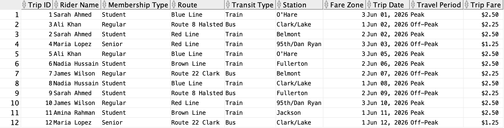
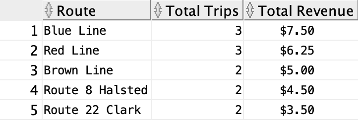

# Transit Analytics Database

**Portfolio Project by Nimrah Ashraf**

An Oracle SQL portfolio project that models a public transit system using relational database design, SQL views, and business reporting. This project demonstrates database design principles, table relationships, and analytical SQL queries through a fictional public transit system.

---

## Technologies

- Oracle SQL
- Relational Database Design
- SQL Views
- Aggregate Functions
- Data Formatting
- Business Reporting

---

## Project Overview

This project models a public transit system using four core entities:

- Riders
- Routes
- Stations
- Trips

The database supports business reporting by analyzing rider activity, transit usage, and revenue across the transit network.

---

## Database Features

- Four normalized relational tables
- Primary and foreign key relationships
- SQL view (`TripSummary`) for simplified reporting
- CHECK constraints for data validation
- Indexes to improve query performance

---

## Entity-Relationship (ER) Diagram

The ER diagram illustrates the relationships between the core entities in the Transit Analytics Database.

---

## Database Schema

The database schema provides a detailed view of each table, including primary keys, foreign keys, constraints, indexes, and the reporting view.

---

## Sample Reports

### Complete Trip History

Displays every transit trip with rider information, transit route, station, travel period, trip date, and fare.

---

### Revenue by Route

Summarizes the total number of trips and total revenue generated for each transit route.

---

### Trips by Membership Type

Displays the number of trips taken by each rider membership type.

---

### Average Fare by Transit Type

Calculates the average fare for each mode of transportation.

---

## SQL Skills Demonstrated

- Primary Keys
- Foreign Keys
- Relational Database Design
- SQL Views
- Aggregate Functions
- `GROUP BY`
- `ORDER BY`
- `COUNT()`
- `SUM()`
- `AVG()`
- `ROUND()`
- `TO_CHAR()`
- Business Reporting

---

## Repository Contents

| File | Description |
|------|-------------|
| `schema.sql` | Creates the database tables, constraints, indexes, and reporting view. |
| `data.sql` | Inserts sample transit data into the database. |
| `queries.sql` | Contains business reporting and analytical SQL queries. |
| `er-diagram.png` | Entity-Relationship diagram of the database. |
| `database-schema.png` | Database schema showing tables, keys, constraints, and indexes. |

---

## Future Improvements

- Add payment methods and fare transactions
- Expand the dataset with additional riders, routes, and stations
- Generate monthly and yearly reporting
- Build an interactive dashboard for transit analytics
- Create stored procedures and triggers for additional business logic

---

## Author

**Nimrah Ashraf**

Master's Student in Computer Science

Interested in Software Engineering, Artificial Intelligence, Human-Computer Interaction, and Data-Driven System Design.
