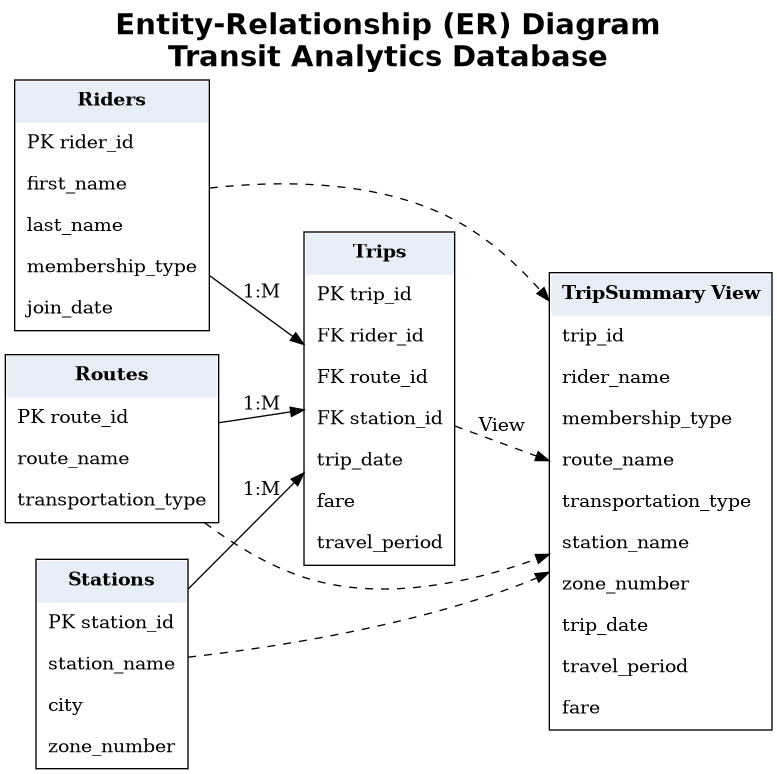
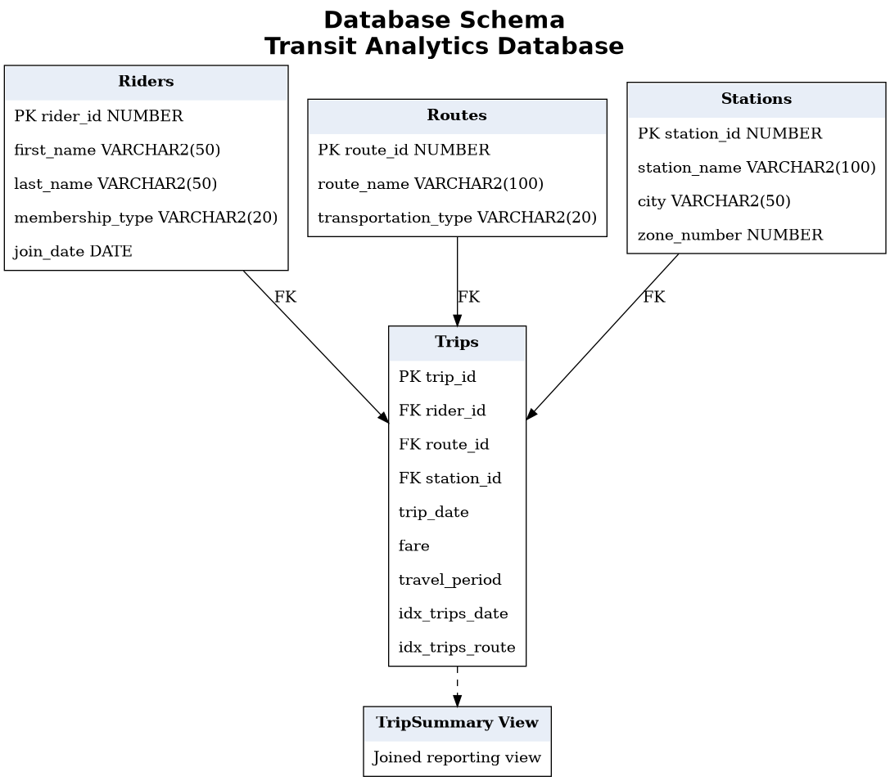
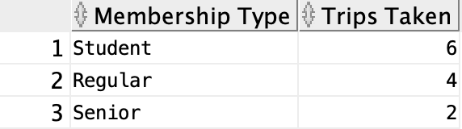
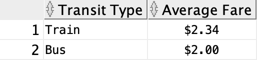

# Transit Analytics Database

**Portfolio Project by Nimrah Ashraf**

An Oracle SQL portfolio project that models a public transit system using relational database design, SQL views, and business reporting. This project demonstrates database design, data relationships, and analytical SQL queries for a fictional transit system.

---

## Technologies

- Oracle SQL
- Relational Database Design
- SQL Views
- Aggregate Functions
- Data Formatting
- Business Reporting

---

## Project Overview

This project models a public transit system using four core entities:

- Riders
- Routes
- Stations
- Trips

The database supports business reporting by analyzing rider activity, transit usage, and revenue across the transit network.

---

## Database Features

- Four normalized relational tables
- Primary and foreign key relationships
- SQL view (`TripSummary`) for simplified reporting
- Data validation using CHECK constraints
- Indexes to improve query performance

---

## Entity-Relationship (ER) Diagram

---

## Database Schema

---

## Sample Reports

### Complete Trip History

Displays every transit trip with rider information, route details, station information, travel period, trip date, and fare.

---

### Revenue by Route

Summarizes the total number of trips and revenue generated for each transit route.

---

### Trips by Membership Type

Displays the number of trips taken by each rider membership type.

---

### Average Fare by Transit Type

Calculates the average fare for each mode of transportation.

---

## SQL Skills Demonstrated

- Primary Keys
- Foreign Keys
- Table Relationships
- SQL Views
- Aggregate Functions
- `GROUP BY`
- `ORDER BY`
- `COUNT()`
- `SUM()`
- `AVG()`
- `ROUND()`
- `TO_CHAR()`
- Business Reporting

---

## Repository Contents

- `schema.sql` – Creates the database tables, constraints, indexes, and reporting view.
- `data.sql` – Inserts sample transit data.
- `queries.sql` – Contains business reporting and analytics queries.
- ER Diagram
- Database Schema
- Sample Report Screenshots

---

## Future Improvements

- Add payment methods
- Expand the dataset
- Monthly reporting
- Interactive dashboard integration

---

## Author

**Nimrah Ashraf**

Master's Student in Computer Science

Interested in Software Engineering, Artificial Intelligence, and Human-Computer Interaction.
